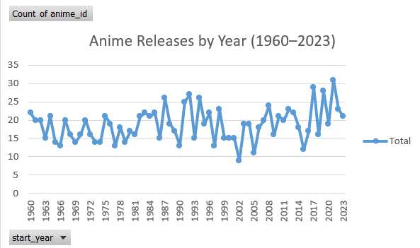
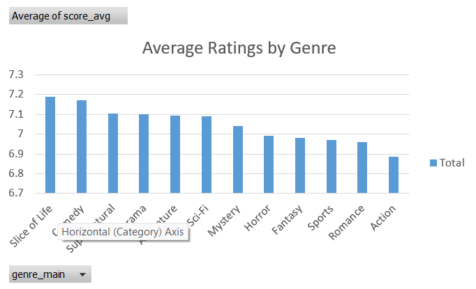
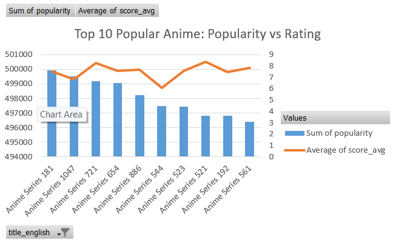
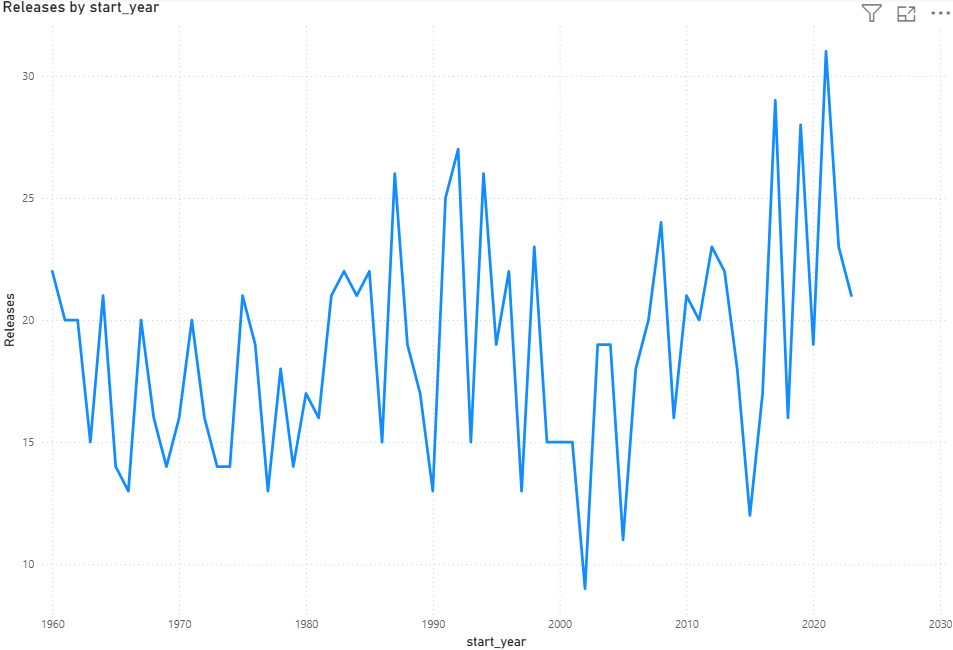
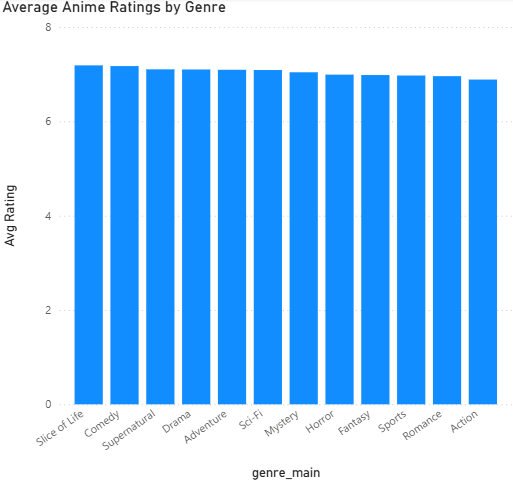
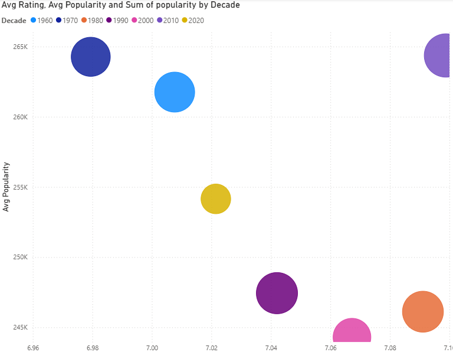

# 🎥📊 Anime Analytics Portfolio

## Overview  
This project analyzes trends in **anime releases, genres, ratings, popularity, and studios** using real datasets.  
The goal is to demonstrate skills in **Excel, SQL (DuckDB), and Power BI**, while telling a clear and data-driven story.

---

## Dataset 📂  
- **Anime TV Series Dataset (1,200+ entries)**  
  - Release years: 1960–2023  
  - Genres, studios, number of episodes  
  - Average ratings (0–10)  
  - Popularity counts (audience size)  

### Data Sources  
- **AniList API** → [Docs](https://anilist.gitbook.io/anilist-apiv2-docs/)  
- **MyAnimeList Community Data (via Kaggle, 2023)**  

Dataset stored in [`/data/anime_tv_series_dataset.csv`](data/anime_tv_series_dataset.csv).

---

## Tools Used 🛠️  
- **Excel** → Pivot tables & charts  
- **DuckDB (SQL)** → Fast queries on CSV data  
- **Power BI** → Interactive dashboard & visuals  
- **GitHub** → Portfolio hosting  

---

## Analysis & Visuals 📊  

### 🔹 Excel Outputs
- Anime releases by year (1960–2023)  
- Average ratings by genre  
- Top 10 studios by average rating  

  
  
  

---

### 🔹 SQL (DuckDB)  
Queries included in [`/sql/queries.sql`](sql/queries.sql).  

Key queries:  
- Number of releases per year  
- Average rating by genre  
- Top 10 studios by rating  

**Query outputs (CSV):**  
- [Releases by Year](sql/releases_by_year.csv)  
- [Average Rating by Genre](sql/avg_rating_by_genre.csv)  
- [Top 10 Studios by Rating](sql/top10_studios.csv)  

---

### 🔹 Power BI Outputs
- Line chart → Anime releases over time  
- Bar chart → Ratings by genre  
- Scatter plot → Popularity vs ratings (colored by decade, bubble size = popularity)  

  
  
  

👉 Full interactive dashboard in [`/powerbi/anime_analytics.pbix`](powerbi/anime_analytics.pbix).  

---

## How to Reproduce ⚙️  
1. Clone this repo.  
2. Open the dataset in `/data/`.  
3. Run the SQL queries in DuckDB or any SQL tool.  
4. Open the Power BI `.pbix` file to interact with the dashboard.  
5. Review charts directly in `/images/` if you don’t want to run tools.  

---

## Key Insights ✨  
- **Anime production** has grown rapidly since the 1980s, peaking in the 2010s.  
- **Drama and Mystery genres** often achieve the highest ratings.  
- **Popularity ≠ Quality** — some highly popular shows have lower ratings, while niche titles rank very high.  
- **Studios like Kyoto Animation, Madhouse, and Wit Studio** consistently deliver critically acclaimed works.  

---

## License 📜  
This project is for educational & portfolio purposes only.  
Data originates from **AniList API** and **MyAnimeList (via Kaggle)**.
